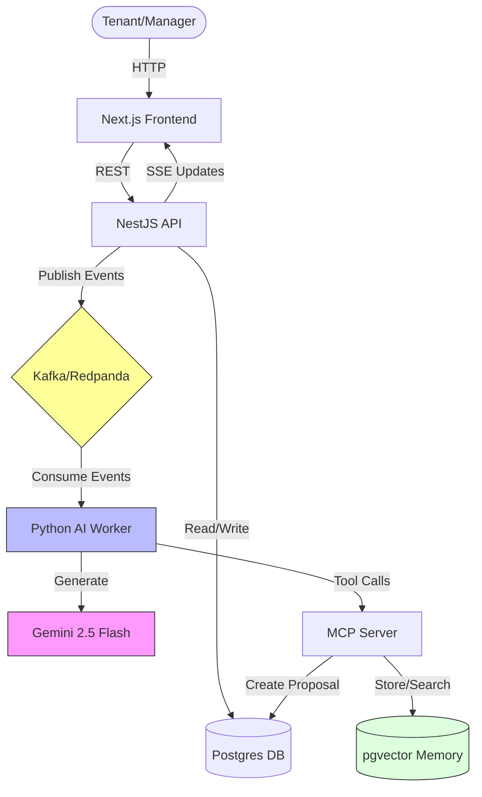

# Property Maintenance AI Triage System

An event-driven property maintenance system. It uses **AI (Gemini)** to triage tickets, **RAG** to recall past resolutions, and **Human-in-the-Loop** workflows to ensure safety.

Built to demonstrate a modular architecture using events, tools (MCP), and memory.

## Architecture



## How It Works

### 1. Triage (Classification)
A tenant reports **"Boiler making weird clicking noise"**.
1.  **Ingestion**: The system accepts the ticket and publishes an event (`ticket.created`).
2.  **Analysis**: The AI Worker analyzes the text.
3.  **Triage**: It classifies the issue as **URGENT** (Priority 4).
4.  **Action**: If confidence is high, it updates the status automatically.

### 2. Resolution (Learning)
The manager assigns a vendor who fixes the issue: *"Replaced faulty thermocouple."*
*   **Vector Storage**: When resolved, the system **embeds** the problem and solution into the vector database (pgvector).
*   This builds a knowledge base for future incidents.

### 3. Recall (RAG)
Two weeks later, a different unit reports **"No heat, clicking sound"**.
1.  **Recall**: Before answering, the AI searches its vector memory.
2.  **Context**: It retrieves the previous "thermocouple" incident.
3.  **Result**: The AI suggests: *"Likely thermocouple issue, based on similar incident in Unit 101."*


## Quick Start

```bash
# 1. Start infrastructure
docker-compose up -d

# 2. Setup Database & Memory
cd apps/api && pnpm prisma migrate deploy && cd ..
./scripts/setup-memory.sh

# 3. Start Services (3 Terminals)
cd apps/api && pnpm run start:dev          # API
cd apps/mcp-server && npx ts-node src/index.ts  # MCP Tools
cd apps/ai-worker && python -m ai_worker.main   # AI Worker

# 4. Run the Full Demo
./scripts/demo-full.sh
```

## License

MIT
