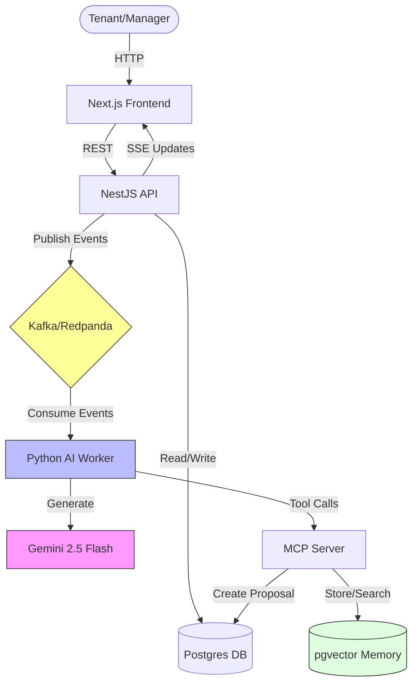

# System Architecture

## Overview

The **Maintenance OS** is an event-driven system designed to demonstrate "Agentic" workflows. It decouples the **Action** (API/User), the **Intelligence** (AI Worker), and the **Memory** (Postgres/pgvector).

## High-Level Architecture



## Core Components

### 1. API Server (NestJS)
*   **Role**: The "Central Nervous System".
*   **Responsibilities**:
    *   Handles REST requests from the frontend.
    *   Writes state to Postgres (`tickets`, `messages`).
    *   **Transactional Outbox**: Writes events to `outbox_events` table in the same transaction as business data to ensure reliability.
    *   Background Poller: Publishes pending events to Redpanda.

### 2. AI Worker (Python)
*   **Role**: The "Brain".
*   **Responsibilities**:
    *   Consumes events (`ticket.created`, `ticket.resolved`) from Redpanda.
    *   **Stateless**: Does not touch the DB directly. All side effects happen via **MCP Tools**.
    *   Uses **Gemini 2.5 Flash** for reasoning and decision making.

### 3. MCP Server (Node/TypeScript)
*   **Role**: The "Hands".
*   **Responsibilities**:
    *   Exposes safe, governed tools to the AI.
    *   `get_ticket_context`: Read-only access to ticket data.
    *   `create_action_proposal`: The ONLY way the AI can change state.
    *   `search_memory` / `store_memory`: Vector DB interactions.

### 4. Memory (Postgres + pgvector)
*   **Role**: The "Long-term Memory".
*   **Responsibilities**:
    *   Stores `memory_documents` with **3072-dimensional embeddings** (`text-embedding-004`).
    *   Uses HNSW index for fast similarity search.

## Data Flow (The "Triage Loop")

```mermaid
sequenceDiagram
    participant Ticket as Ticket (New)
    participant AI as AI Worker
    participant Manager
    participant Vendor
    participant Memory as Memory

    Ticket->>AI: Created (Event)
    AI->>Memory: Search Similar Incidents (RAG)
    Memory-->>AI: Found "Boiler Issue" (Unit 101)
    
    altern high confidence
        AI->>Ticket: Auto-Triage (Category/Priority)
    else low confidence
        AI->>Manager: Propose Triage
        Manager->>Ticket: Approve Triage
    end
    
    Manager->>Vendor: Assign Task
    Vendor->>Ticket: Resolve Issue
    Ticket-->>Memory: Store Resolution (Embedding)
```
